# ArtInsights

This was my first full-fleged Angular project. This application provides the user with insights on how their artworks are received on DeviantArt and Tumblr, two social media sites with large communities of artists. It also allows the user to manage their followings on both sites, and search artworks by tag on DeviantArt, Tumblr, and Twitter.

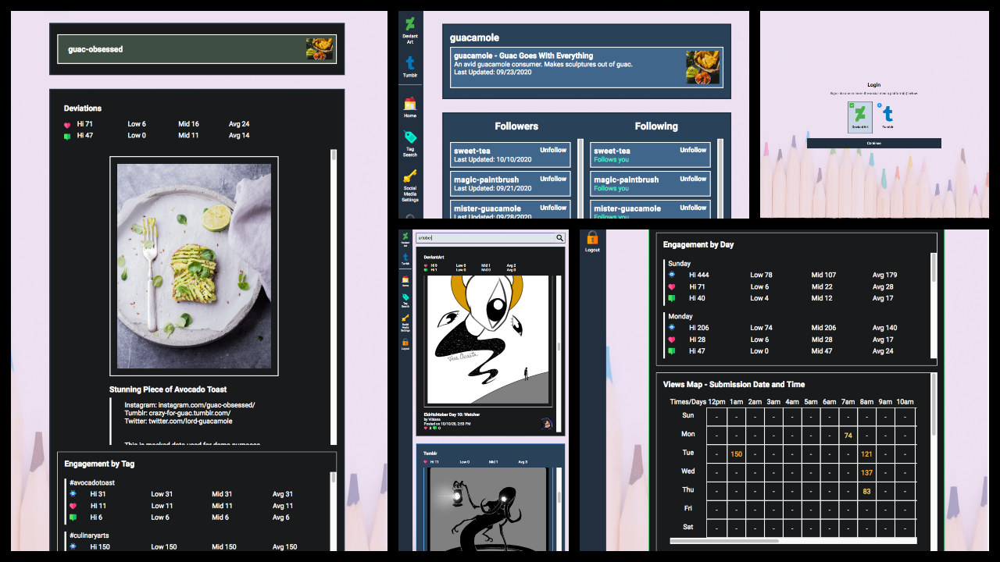
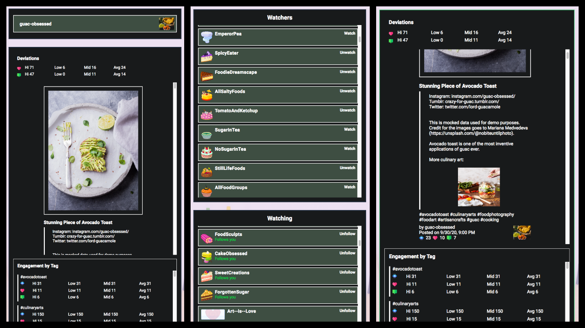

## Demos

<a href="https://youtu.be/yAg1yCC9n8Y">Part I - Registration, Login, Auth, Tag Search</a> 
<a href="https://youtu.be/5cUuG4xZd_o">Part II - DeviantArt</a>

## Features

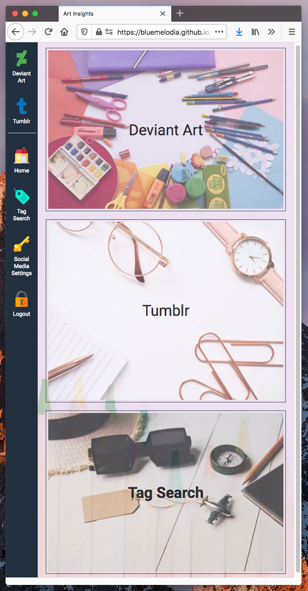

- Support user account creation and login.

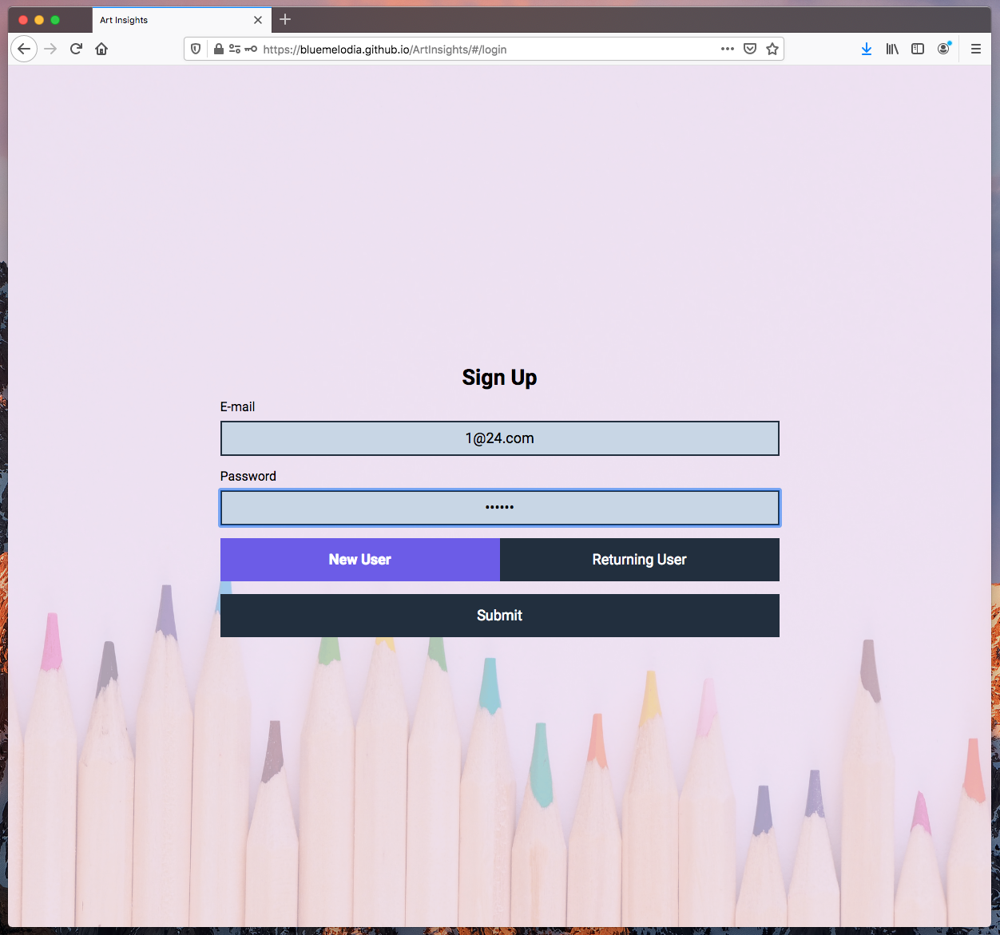

- Authorize the application to fetch information about the user's DeviantArt and Tumblr accounts. 

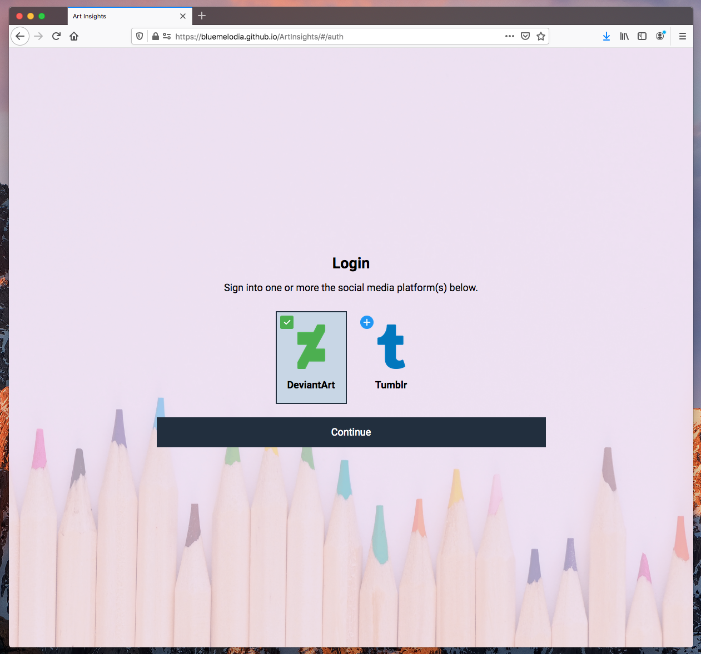

DeviantArt
- View information about the user's deviations (artworks), including tags used, and level of engagement (favorites, comments, views) per piece. The user is able to view the entire deviation description that accompanied their original deviation, including embedded images (thumbs) and emoticons.
- View engagement levels by tags and day / time of deviation submission.
- View information about friends (deviants and groups the user is following) and followers, including whether the friendship is mutual (the deviations/groups the user is following is following them back).
- Watch / unwatch deviants and groups.

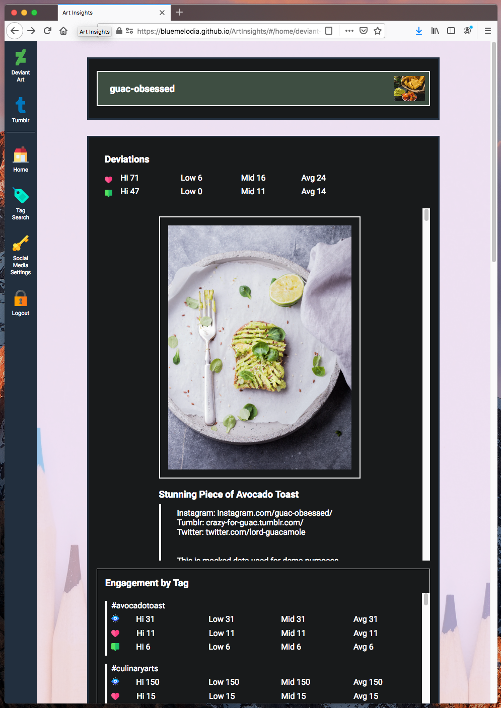
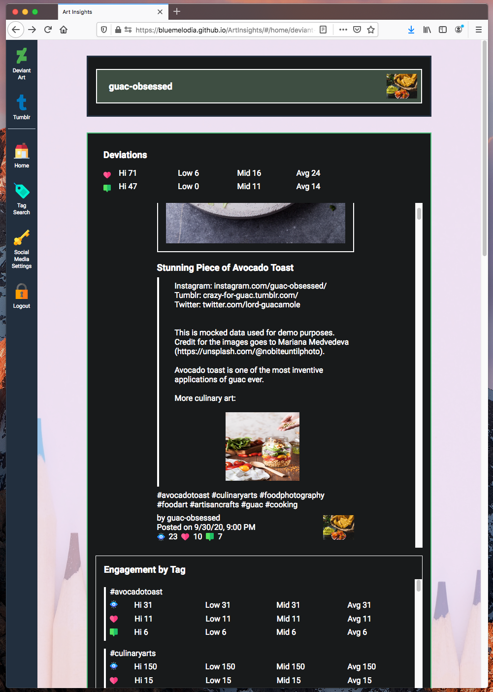

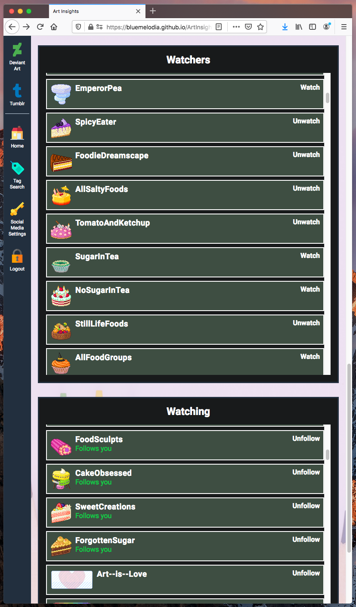

Tumblr
- See which blogs are following the user, and which blogs the user is following. Includes information about mutual followings.
- Follow / unfollow blogs.

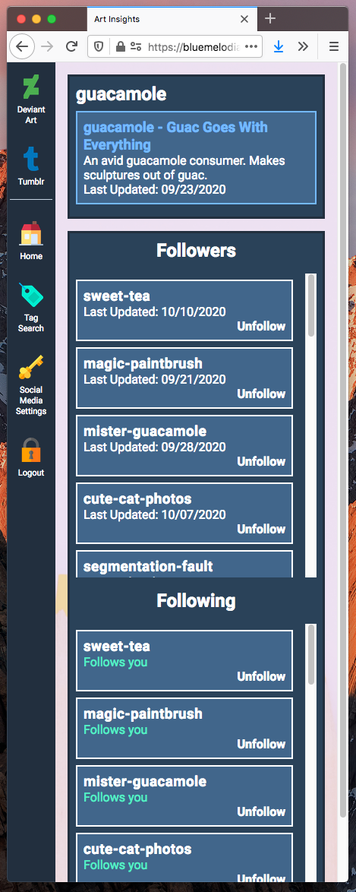
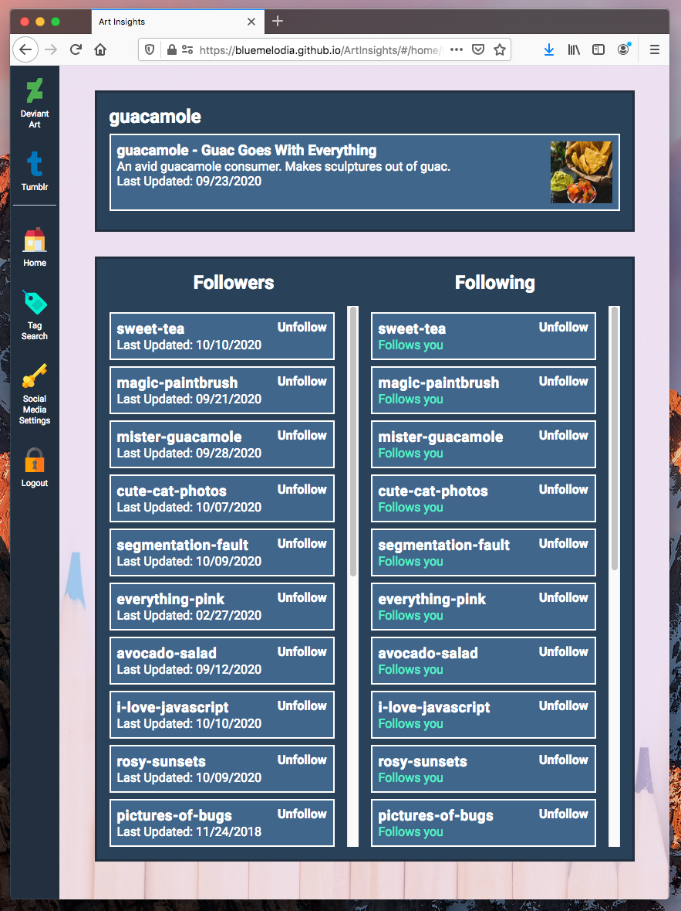
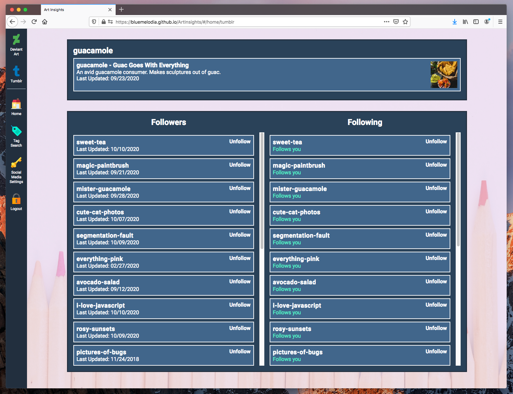

Tag Search
- Search for visual artworks (ex. drawings, photographs) by tag on DeviantArt, Tumblr, and Twitter. 
- View engagement levels per piece and per tag.

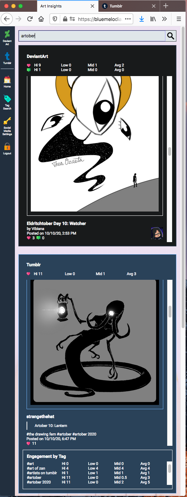
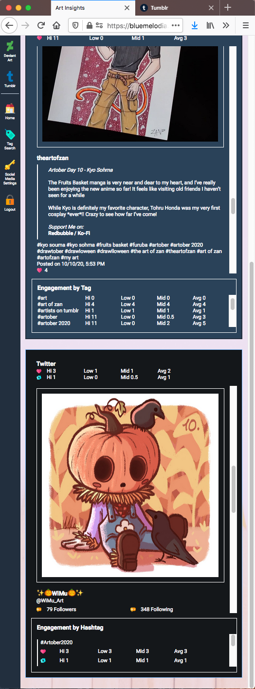

Data and images in app screenshots and videos are mocked and blurred to protect user privacy.

Icons credit:
<a href="https://www.deviantart.com/riverkpocc">riverkpocc</a>

This project was generated with [Angular CLI](https://github.com/angular/angular-cli) version 10.0.1.

## Architecture

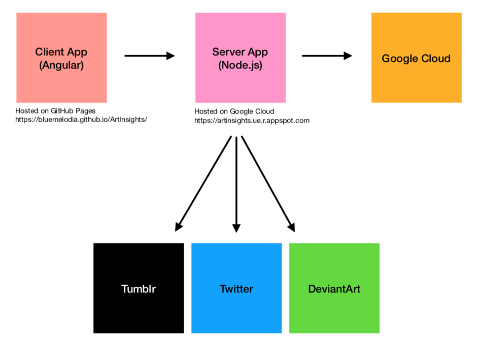

User Registration: 
1) When the user submits the registration form with a valid username (valid e-mail address) and password (at least six characters long), the client app calls the server’s register endpoint.
2) If the user provided a valid username and password, the server makes a call to the Firebase Authentication service to create a user with the given e-mail and password.
3) On successful registration, the client app shows a success notification to the user. Otherwise, the app shows a failure notification (ex. the e-mail address is not available).

User Login:
1) When the user submits the login form with a valid username and password (same validation rules as user registration), the client app calls the server's login endpoint.
2) If the user provided a valid username nad password, the server makes a call to the Firebase Authentication service to sign in the user with the provided e-mail and password. 
3) On successful login, the server asks Firebase for the user ID token, which is then used to exchange for a session cookie.
4) The server passes the user ID token to the Firebase Authentication service. On successful verification, the server checks that the user was recently signed in before asking the Firebase Authentication service to create a session cookie. 
5) The server saves the returned session cookie (used as the auth token) in the Firebase Cloud Firestore, then sends a success message back to the client with the token as the payload. 
6) The client app saves the auth token in the browser's session storage. These values are salved locally and are persisted until the window or tab is closed or when the user clicks on the logout button.

Social Media OAuth: 

The mechanism for DeviantArt and Tumblr is similar.

1) On successful login, the user is taken to the auth page, where they have the choice of authenticating their Tumblr and/or DeviantArt accounts. At least one of the two accounts is required in order to proceed. 
2) When the user clicks on the DeviantArt icon, the click handler will either authenticate or unauthenticate the user based on their current status. 
3) If the user is not yet authenticated with DeviantArt, the client calls the server's art/auth endpoint, which returns the URL of the redirect URL to display to the user.
4) On receiving the server's response, the client opens the redirect URL in a new tab. Once the user enters their credentials into the DeviantArt redirect page and clicks the login button, DeviantArt calls the server art/callback endpoint with the authorization code as a parameter.
5) The server calls the DeviantArt auth token URL (https://www.deviantart.com/oauth2/token?&grant_type=authorization_code), including the authorization code as a query parameter, and exchanges it for the authorization token.
6) The server saves the authorization token in Firebase, using the request session id as the key. On subsequent user requests, the server will obtain the authorization token from firebase using the persisted request session id.
7) Depending on whether the auth token was successfully obtained, the server returns either a success or failure HTML template for the client to render. This template contains code to automatically close the client-opened tab after three seconds. 
8) After the success HTML page is rendered, the script in the template uses the postMessage API to notify the client app that authorization has either succeeded or failed for DeviantArt.
9) The client saves the outcome (success or failure) of the authentication attempt into session storage and alerts all subscribers of the change. This will result in some UI changes, such as enabling/disabling the DeviantArt button in the navigation bar and enabling/preventing users from directly routing to the DeviantArt page within the app.
10) If the clients attempts to make any service calls without the proper authentication, they will be redirected to the auth page and given an opportunity to re-authenticate.

## Platform Support

## User Agent Strings

Firefox Desktop:

mozilla/5.0 (macintosh; intel mac os x 10.14; rv:81.0) gecko/20100101 firefox/81.0

Chrome Desktop:

mozilla/5.0 (macintosh; intel mac os x 10_14_6) applewebkit/537.36 (khtml, like gecko) chrome/86.0.4240.111 safari/537.36

Safari Desktop:

mozilla/5.0 (macintosh; intel mac os x 10_14_6) applewebkit/605.1.15 (khtml, like gecko) version/14.0 safari/605.1.15

Firefox iOS:

mozilla/5.0 (macintosh; intel mac osx 10_15_4) applewebkit/ 605.1.15 (khtml, like gecko) version/13.1 safari/605.1.15

Chrome iOS:

mozilla/5.0 (iPad; cpu os 13_7 like mac os x) applewebkit/605.1.15 (khtml, like gecko) crios/ 86.0.4240.95 mobile/15e148 safari/604.1

Safari iOS:

mozilla/5.0 (iPad; cpu os 13_7 like mac os x) applewebkit/605.1.15 (khtml, like gecko) version/13.1.2 mobile/15e148 safari/604.1

## Known Issues

- On Firefox mobile, clicking on the social media button on the auth page does not open a new tab.
- On Safari iPhone/iPad, sessions are not persisted.

### Update 11/1/20 - Chrome Support Added

As of 11/1/20 the application is supported on Chrome. Originally sessions were not being persisted (req.session.id was different on each request), and thus user were getting unauthenticated on subsequent requests to the DeviantArt and Tumblr APIs. There were two main root causes:

1) Chrome was not allowing request cookies to be sent to the server because the initial response cookies sent from the server did not specify SameSite = None. The server and client are on different domains, hence the cookies sent back by the server as considered third-party cookies - Chrome will not send these cookies by default. Without the request cookies, the server cannot maintain the session as it cannot tell that the initial (auth) and subsequent (DA/Tumblr) requests were sent from the same client.

2) After fixing the cookies, the client requests were being split across multiple instances, hence some requests to the DA/Tumblr APIs were failing due to having a different req.session id. Updating my NodeJS project's app.yaml file to use one instance fixed this issue.

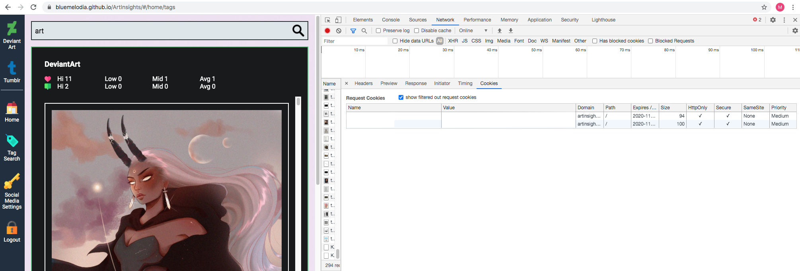

## Development server

Run `ng serve` for a dev server. Navigate to `http://localhost:4200/`. The app will automatically reload if you change any of the source files.

## Deployment steps

### Client side

To deploy to GitHub pages, run the following commands:

    1) Generate distributable files in the docs folder. 
 
       npm run build:prod

    2) Check the docs folder is created and contains the distributable files.

        

    3) Commit the contents folder, and push it to the repo.

        git add .
        git commit -m "<commit-message>"
        git push -u origin master

### Server side

In the folder where the `app.yaml` file is located, run `gcloud app deploy`. Each time this command is run, a new version of the service is created, and traffic is automatically routed to the latest version. 

Run `gcloud app browse` to view the service in the browser.

## Code scaffolding

Run `ng generate component component-name` to generate a new component. You can also use `ng generate directive|pipe|service|class|guard|interface|enum|module`.

## Build

For the dev build (build:dev command in package.json):

  `webpack-dev-server --inline --hot --progress --port 8080`

--hot enables webpack Hot Module Replacement (HMR). It exchanges, adds, or removes modules while an application is running, without a full reload. This helps:

    Retain the application state, which is lost during a full reload.

    Only update what’s changed.

    Changes to CSS/JS result in an instant browser update, which is almost comparable to changing the styles directly in the browser’s dev tools.

build:clean: 

    To keep the project clean, delete the files that the Angular compiler generated in order to compile the application. We delete the files before compilation, and after generating bundles. 

build:prod: 

    run the Angular compiler with the ngc command, and then run webpack in production mode to generate the bundles.

Source: <a href="https://www.freecodecamp.org/news/how-to-configure-webpack-4-with-angular-7-a-complete-guide-9a23c879f471/">How to configure Webpack 4 with Angular 7: a complete guide</a>

## Further help

To get more help on the Angular CLI use `ng help` or go check out the [Angular CLI README](https://github.com/angular/angular-cli/blob/master/README.md).

## Tutorial Credits

<a href="https://www.freecodecamp.org/news/how-to-configure-webpack-4-with-angular-7-a-complete-guide-9a23c879f471/">How to configure Webpack 4 with Angular 7: a complete guide</a>

<a href="https://medium.com/a-beginners-guide-for-webpack-2/copy-all-images-files-to-a-folder-using-copy-webpack-plugin-7c8cf2de7676">Copy all images/files to a folder using copy-webpack-plugin</a>

<a href="https://shermandigital.com/blog/fix-404-errors-from-angular-projects-hosted-on-github-pages/#:~:text=If%20you%20deploy%20an%20Angular,html%20page.&text=To%20accomplish%20the%20redirect%2C%20create,of%20the%20angular%2Dcli%20application.">Fix 404 Errors from Angular Projects Hosted on Github Pages
</a>

<a href="https://pumpingco.de/blog/automatic-scrolling-only-if-a-user-already-scrolled-the-bottom-of-a-page-in-angular/">Automatic scrolling, only if a user already scrolled the bottom of a page in Angular</a>

## Asset Credits

Icons made by:

<a href="https://www.flaticon.com/authors/dinosoftlabs" title="DinosoftLabs">DinosoftLabs</a> 
<a href="https://www.flaticon.com/authors/freepik" title="Freepik">Freepik</a> 
<a href="https://www.flaticon.com/authors/good-ware" title="Good Ware">Good Ware</a> 
<a href="https://www.flaticon.com/authors/kiranshastry" title="Kiranshastry">Kiranshastry</a> 
<a href="https://www.flaticon.com/authors/pixel-perfect" title="Pixel perfect">Pixel perfect</a> 
from <a href="https://www.flaticon.com/" title="Flaticon">www.flaticon.com</a>

Photos by:

<a href="https://www.pexels.com/@jessbaileydesign">Jess Bailey Designs</a> 
<a href="https://www.pexels.com/@pixabay">Pixabay</a> 
<a href="https://www.pexels.com/@nurseryart">Porapak Apichodilok</a> 
<a href="https://unsplash.com/@juanmgiraldo96">Juan Manuel Giraldo Grisales</a>