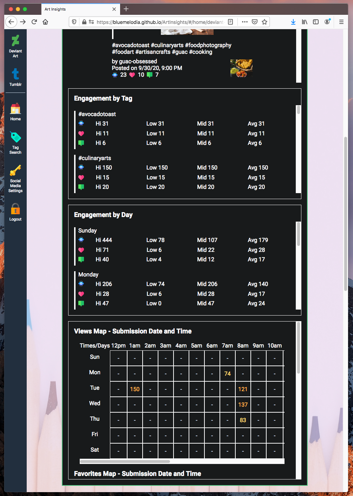

# ArtInsights

This was my first full-fleged Angular project. This application provides the user with insights on how their artworks are received on DeviantArt and Tumblr, two social media sites with large communities of artists. It also allows the user to manage their followings on both sites.

Main features:

- Support user account creation and login.

- Authorize the application to fetch information about the user's DeviantArt and Tumblr accounts. 

DeviantArt
- View information about the user's deviations (artworks), including tags used, and level of engagement (favorites, comments, views) per piece. The user is able to view the entire deviation description that accompanied their original deviation, including embedded images (thumbs) and emoticons.
- View engagement levels by tags and day / time of deviation submission.
- View information about friends (deviants and groups the user is following) and followers, including whether the friendship is mutual (the deviations/groups the user is following is following them back).
- Watch / unwatch deviants and groups.

Tumblr
- See which blogs are following the user, and which blogs the user is following. Includes information about mutual followings.
- Follow / unfollow blogs.

Tag Search
- Search for visual artworks (ex. drawings, photographs) by tag on DeviantArt, Tumblr, and Twitter. 
- View engagement levels per piece and per tag.

The application can be run on: Safari (desktop), Firefox (both desktop & mobile). 

Chrome and Safari mobile are not supported as when these browsers are used, req.session.id is not persisted on the server side in-between requests. This is probably due to incorrect backend configuration. As the primary purpose of this project was for me to practice Angular and CSS, I will address these issues in a future project.

Data and images in app screenshots and videos are mocked and blurred to protect user privacy.

Icons credit:
<a href="https://www.deviantart.com/riverkpocc">riverkpocc</a>

This project was generated with [Angular CLI](https://github.com/angular/angular-cli) version 10.0.1.

## Development server

Run `ng serve` for a dev server. Navigate to `http://localhost:4200/`. The app will automatically reload if you change any of the source files.

## Deployment steps

### Client side

To deploy to GitHub pages, run the following commands:

    1) Generate distributable files in the docs folder. 
 
       npm run build:prod

    2) Check the docs folder is created and contains the distributable files.

        

    3) Commit the contents folder, and push it to the repo.

        git add .
        git commit -m "<commit-message>"
        git push -u origin master

### Server side

In the folder where the `app.yaml` file is located, run `gcloud app deploy`. Each time this command is run, a new version of the service is created, and traffic is automatically routed to the latest version. 

Run `gcloud app browse` to view the service in the browser.

## Code scaffolding

Run `ng generate component component-name` to generate a new component. You can also use `ng generate directive|pipe|service|class|guard|interface|enum|module`.

## Build

For the dev build (build:dev command in package.json):

  `webpack-dev-server --inline --hot --progress --port 8080`

--hot enables webpack Hot Module Replacement (HMR). It exchanges, adds, or removes modules while an application is running, without a full reload. This helps:

    Retain the application state, which is lost during a full reload.

    Only update what’s changed.

    Changes to CSS/JS result in an instant browser update, which is almost comparable to changing the styles directly in the browser’s dev tools.

build:clean: 

    To keep the project clean, delete the files that the Angular compiler generated in order to compile the application. We delete the files before compilation, and after generating bundles. 

build:prod: 

    run the Angular compiler with the ngc command, and then run webpack in production mode to generate the bundles.

Source: <a href="https://www.freecodecamp.org/news/how-to-configure-webpack-4-with-angular-7-a-complete-guide-9a23c879f471/">How to configure Webpack 4 with Angular 7: a complete guide</a>

## Further help

To get more help on the Angular CLI use `ng help` or go check out the [Angular CLI README](https://github.com/angular/angular-cli/blob/master/README.md).

## Tutorial Credits

<a href="https://www.freecodecamp.org/news/how-to-configure-webpack-4-with-angular-7-a-complete-guide-9a23c879f471/">How to configure Webpack 4 with Angular 7: a complete guide</a>

<a href="https://medium.com/a-beginners-guide-for-webpack-2/copy-all-images-files-to-a-folder-using-copy-webpack-plugin-7c8cf2de7676">Copy all images/files to a folder using copy-webpack-plugin</a>

<a href="https://shermandigital.com/blog/fix-404-errors-from-angular-projects-hosted-on-github-pages/#:~:text=If%20you%20deploy%20an%20Angular,html%20page.&text=To%20accomplish%20the%20redirect%2C%20create,of%20the%20angular%2Dcli%20application.">Fix 404 Errors from Angular Projects Hosted on Github Pages
</a>

<a href="https://pumpingco.de/blog/automatic-scrolling-only-if-a-user-already-scrolled-the-bottom-of-a-page-in-angular/">Automatic scrolling, only if a user already scrolled the bottom of a page in Angular</a>

## Asset Credits

Icons made by:

<a href="https://www.flaticon.com/authors/dinosoftlabs" title="DinosoftLabs">DinosoftLabs</a> 
<a href="https://www.flaticon.com/authors/freepik" title="Freepik">Freepik</a> 
<a href="https://www.flaticon.com/authors/good-ware" title="Good Ware">Good Ware</a> 
<a href="https://www.flaticon.com/authors/kiranshastry" title="Kiranshastry">Kiranshastry</a> 
<a href="https://www.flaticon.com/authors/pixel-perfect" title="Pixel perfect">Pixel perfect</a> 
from <a href="https://www.flaticon.com/" title="Flaticon">www.flaticon.com</a>

Photos by:
<a href="https://www.pexels.com/@jessbaileydesign">Jess Bailey Designs</a> 
<a href="https://www.pexels.com/@pixabay">Pixabay</a> 
<a href="https://www.pexels.com/@nurseryart">Porapak Apichodilok</a> 
<a href="https://unsplash.com/@juanmgiraldo96">Juan Manuel Giraldo Grisales</a>